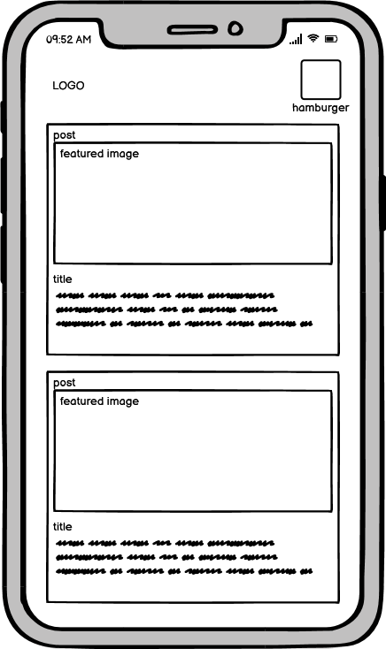

# Blogject

Blogject is a blog/news website where users can create and share posts with other users.

The objective of the site is to promote positive engagement between like minded people. The site has a strong social element where users can like and comment on other users posts and subscribe to users who consistently make good content. Each user has their own profile that they can edit to make their own. including a user bio, user profile picture and other social media handles 

you can visit the website [here](https://blogject.herokuapp.com/)

## User Experience

### project goals

* a responsive design that allows for easy navigation on a variety of screen sizes

* a place where users can post their thoughts and ideas in a blog format

* account authorisations to allow engagement between users as well as a page where other users can see all your posts.

* a simple yet pleasant colour scheme as to promote a fun and relaxed atmosphere

### user goals

* as a site admin, i need to manage the content of my site.

* as a site user, i want to be able to view posts.

* as a site user, i want to be able to create posts.

* as a site user, i want to be able to edit and delete my existing posts.

* as a site user i want to be able to like and comment on posts

* as a site user i want to have my own profile

* as a site user i want to be able to subscribe to other users.

#### Strategy Table

Issue | value | Feasibility
--- | --- | ---
Responsive design | 5 | 5
Account registration | 5 | 5
Create, edit and delete posts | 5 | 5
Comment on Posts | 4 | 5
like user posts | 4 | 5
View user profiles | 5 | 4
Edit user profiles | 4 | 4
Filter posts | 2 | 2
search for posts | 3 | 1
Subscribe to users | 4 | 2
Create, edit and delete comments | 1 | 2
Add tags to posts | 3 | 1
**Total** | **43** | **36**

### scope

Looking at my strategy table it's clear not all features can be put in place for the first release so the project will need to be released in phases with the features that I have identified as most important, ones needed for a viable product, to be released first.

**First Phase**

* Responsive design

* Account registration

* Create, edit and delete posts

* Comment on posts

* View user profiles

* Edit user profiles

* Subscribe to users

* like user posts

**Second Phase**

* Filter posts 

* Create, edit and delete comments 

* Add tags to posts

### User Stories

I wrote user stories to get a better idea of what a user would stand to gain from using my site. using the issue feature i was able to check them off as i developed them, here is my full list of user stories


## structure

The website revolves around the home page. through here you can navigate to most pages from the site. The navigation bar is consistent throughout the site. Both forms and links give clear feedback to the user through messages. the opportunity to create posts and view your profile is available once the user has logged in.


## Database model

The website uses three models, one for posts, one for comments and one is an extension of the user model that adds more functionality, called profile.

**Post model**

* Title = title of the post
    
* Author = author fo the post 
    
* Content = main body of the post
    
* Masthead = first paragraph of the post that gives and idea of what its about
    
* likes = keeps track of the likes and who liked

* Post date = the date the post was made
    
* status = the status of the post i.e. either published or draft
    
* slug = the slug of the post, used for url paths
    
* categories = the category of the post

**Comment**

* Post = the post the comment is relating to
* name = name of the user who made the comment
* email = email of the user who made the comment
* body = the main body of the comment
* approved = whether the comment has been approved by an admin

**Profile**
* user = the user this profile instance is tied to
* profile_image = the users profile image
* slug = the slug that leads to the users profile
* subscribers = list of all the users subscribers
* subscribed_to = list of all users that this user is subscribed to
* user_bio = a small description, written by the user, about themselves
* twitter_handle = the users twitter handle
* youtube_handle = the users youtube handle
* instagram_handle = the users instagram handle

## WireFrames

### Home




### profile


### create post


### post detail


## Features

### General

- responsive design across all devices.


- navigation bar can contains the company logo and links to other pages. the links turn into a hamburger menu when the screen size decreases. 


### home page

- the home page displays a paginated list of all articles sorted from newest first. 

- the articles are displayed through cards that show all the relevant information about the article.


### post detail page

- the post detail page shows the main content of the article. The title, author, featured image and post date are at the top in the masthead and followed by the main content. 


- users are able to like the post and to subscribe to the author of the post the info box just under the content.

- users are able to leave comments and have them listed with other comments.


### profile page

- users can view their and other users profiles

- users can gain subscribers if they consistently post well

- users have a user bio section that offers a brief description of that user, they can also upload a profile picture.

- from here users can edit their posts and delete their posts

- users can view all their posts in a paginated list as well as the posts from user they are subscribed to.

- users can offer media links to their other social media accounts.


### new post page

- users can create new posts from here

- easily found in the navbar at the top if that user has been authenticated


### edit post page

- users can edit their posts from this page


### edit profile page

- users can edit their profile from this page


### user authentication pages

- using allauth i have implemented user authentication

- users can register, log in and log out

## Testing

### code validation

using the flake8 and pylint linter in my IDE I've validated my python code

#### veiws.py

* I have ignore the errors here as its a problem with how the linter and django interact

* error regarding the string statement having no effect is my docstrings within my view classes, I've tried putting the docstrings as the first line of the method but that throws a compile error

#### urls.py

* line to long errors here are not important 

* docstrings not important here a anyone who is familiar with django will understand this file

#### forms.py

* docs are actually present throughout the file

#### modals.py

* I have ignore the errors here as its a problem with how the linter and django interact

* docstrings not important here a anyone who is familiar with django will understand this file

### Manual testing

I have gone throughout my site to test if all links are working correctly

Expected outcome | Actual outcome | pass/fail
--- | --- | ---
clicking on home brings you to home | worked as expected | pass
clicking on a post brings you to that post | worked as expected | pass
clicking on like will like the post | worked as expected | pass
clicking on subscribe will subscribes you to that user | worked as expected | pass
clicking on unsubscribe will unsubscribe you from that user | worked as expected | pass
writing a comment will post it to be approved | worked as expected | pass
having a comment approved will show it in the comments section | worked as expected | pass
clicking on profile will take me to the profile page | worked as expected | pass
clicking edit profile will take me to the edit profile page | worked as expected | pass
updated information will be reflected when I submit the edit profile form | worked as expected | pass
clicking next on user posts shows the next page of user posts | worked as expected | pass
clicking next on subscription posts shows the next page of subscription posts | worked as expected | pass
clicking log out logs me out as a user | worked as expected | pass
clicking register will bring me to a form to create an account | worked as expected | pass
filling out the form and submitting it will create an account for me | worked as expected | pass 
inputting my existing user details signs me in | worked as expected | pass
changing the screen size will change the elements of the document to mobile view | worked as expected | pass
clicking edit post will take me to the edit post page | worked as expected | pass
updated information will be reflected when I submit the edit post form | worked as expected | pass
deleting a post will remove it from the database | worked as expected | pass


## Technologies used

### languages used

- Python
- HTML5
- CSS3
- JavaScript

## Libraries and Frameworks

- Django - a web framework that is the back bone fo the site

- Bootstrap 5 - a front end framework that was used for the styling of most of the site. 

- Google Fonts - google offers a wide range of free fonts. 

- Font Awesome - Font Awesome icons were used throughout the site to make it more visually appealing

## Packages / Dependecies Installed

- Cloudinary - Cloudinary was used to store images online as opposed to statically

- Django Allauth - Django Allauth has been used to handle user authentication

- Django Crispy Form - Django Crispy Form has helped with the rendering forms

- Gunicorn - Gunicorn has been used as Python WSGI HTTP Server for UNIX to support the deployment of Django applications.

- Summernote - Summernote was implemented as a WYSIWYG editor.

## software and tools

- Gitpod - he application was written in gitpod, which also helped with pushing and commiting to github

- heroku - the website used to deploy the application

- Youtube - many features I've implemented were taught to me through youtube tutorials

- stack overflow - most bugs and errors were resolved by looking them up through stack overflow

## future features

- plans to introduce social accounts to make authentication easier

- plans to filter posts on the home page by user or category aswell as increase the pagination limit.

## Deployment

This project was developed using a [GitPod](https://gitpod.io/) workspace. The code was commit to [Git](https://git-scm.com/) and pushed to [GitHub](https://github.com/") using the terminal.

### Deploying on Heroku
To deploy this page to Heroku from its GitHub repository, the following steps were taken:

1. Create the Heroku App:
    - Select "Create new app" in Heroku.
    - Choose a name for your app and select the location.

2. Attach the Postgres database:
    - In the Resources tab, under add-ons, type in Postgres and select the Heroku Postgres option.

3. Prepare the environment and settings.py file:
    * In the Settings tab, click on Reveal Config Vars and copy the url next to DATABASE_URL.
    * In your GitPod workspace, create an env.py file in the main directory. 
    * Add the DATABASE_URL value and your chosen SECRET_KEY value to the env.py file.
    * Add the SECRET_KEY value to the Config Vars in Heroku.
    * Update the settings.py file to import the env file and add the SECRETKEY and DATABASE_URL file paths.
    * Update the Config Vars with the Cloudinary url, adding into the settings.py file also.
    * In settings.py add the following sections:
        * Cloudinary to the INSTALLED_APPS list
        * STATICFILE_STORAGE
        * STATICFILES_DIRS
        * STATIC_ROOT
        * MEDIA_URL
        * DEFAULT_FILE_STORAGE
        * TEMPLATES_DIR
        * Update DIRS in TEMPLATES with TEMPLATES_DIR
        * Update ALLOWED_HOSTS with ['app_name.heroku.com', 'localhost']

4. Store Static and Media files in Cloudinary and Deploy to Heroku:
    - Create three directories in the main directory; media, storage and templates.
    - Create a file named "Procfile" in the main directory and add the following:
        - web: gunicorn project-name.wsgi
    - Go to Deploy tab on Heroku and connect to the GitHub, then to the required repository.
    Click on Deploy Branch and wait for the build to load. When the build is complete, the app can be opened through Heroku.

### Forking the Repository
By forking the GitHub Repository we make a copy of the original repository on our GitHub account to view and/or make changes without affecting the original repository by using the following steps...

1. Log into [GitHub](https://github.com/login) or [create an account](https://github.com/join).
2. Locate the [GitHub Repository](https://github.com/josswe26/code-buddy).
3. At the top of the repository, on the right side of the page, select "Fork"
4. You should now have a copy of the original repository in your GitHub account.

### Creating a Clone
How to run this project locally:
1. Install the [GitPod Browser](https://www.gitpod.io/docs/browser-extension/ "Link to Gitpod Browser extension download") Extension for Chrome.
2. After installation, restart the browser.
3. Log into [GitHub](https://github.com/login "Link to GitHub login page") or [create an account](https://github.com/join "Link to GitHub create account page").
2. Locate the [GitHub Repository](https://github.com/josswe26/code-buddy).
5. Click the green "GitPod" button in the top right corner of the repository.
This will trigger a new gitPod workspace to be created from the code in github where you can work locally.

How to run this project within a local IDE, such as VSCode:

1. Log into [GitHub](https://github.com/login) or [create an account](https://github.com/join).
2. Locate the [GitHub Repository](https://github.com/josswe26/code-buddy).
3. Under the repository name, click "Clone or download".
4. In the Clone with HTTPs section, copy the clone URL for the repository.
5. In your local IDE open the terminal.
6. Change the current working directory to the location where you want the cloned directory to be made.
7. Type 'git clone', and then paste the URL you copied in Step 3.
```
git clone https://github.com/josswe26/code-buddy
```
8. Press Enter. Your local clone will be created.

Further reading and troubleshooting on cloning a repository from GitHub [here](https://docs.github.com/en/free-pro-team@latest/github/creating-cloning-and-archiving-repositories/cloning-a-repository)


## Acknowledgements

### Content

most of the website was written by the developer 

help from the code institute tutorial was used including: 

- setting up the project
- Message implementation an dismissal code 

help from youtube tutorials and google

### known bugs
creating a post with the same name will generate a duplicate slug which will lead to an error. a fix would be to validate the title to make it unique or change how slugs are generated.

having an empty user profile picture value should show a placeholder user image instead of nothing 


Many thanks to my mentor Marcel, for his guidance throughout this project as well as the code institute tutor team.
